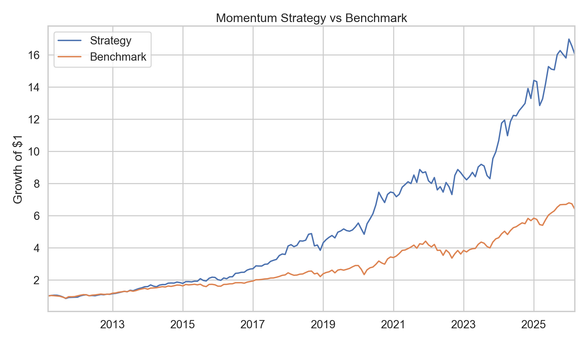
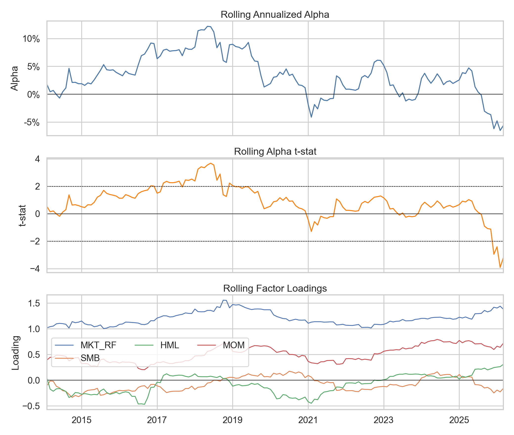

# Factor Model & Equity Backtesting Framework

This repository implements two connected pieces of quantitative research in
Python:

1. A regression toolkit for CAPM, Fama-French 3-factor, Carhart 4-factor, and
   Fama-French 5-factor attribution with Newey-West/HAC standard errors.
2. A from-scratch long-only momentum strategy backtest with monthly
   rebalancing, turnover accounting, transaction costs, and an
   alpha-after-factors test.
3. Rolling factor attribution, parameter sensitivity, regime diagnostics,
   holdings diagnostics, and a lightweight Streamlit dashboard.

The default run attributes `BRK-B`, benchmarks the strategy against `SPY`, and
backtests a 12-month momentum signal on a static liquid US large-cap universe.
The generated sample is capped at the latest available Fama-French factor
month so performance and factor attribution use the same monthly window.

## Headline Results

Latest generated run: 2011-03 to 2026-03.

| Metric | Strategy | Benchmark |
|---|---:|---:|
| CAGR | 20.20% | 13.10% |
| Annualized Volatility | 17.39% | 14.07% |
| Sharpe | 1.07 | 0.85 |
| Sortino | 1.94 | 1.35 |
| Max Drawdown | -21.30% | -23.93% |
| Calmar | 0.95 | 0.55 |
| Information Ratio | 0.69 | n/a |
| Annualized Turnover | 256.63% | n/a |

Alpha after factors:

- CAPM alpha: 0.57%/month, t-stat 2.89
- FF3 alpha: 0.49%/month, t-stat 2.49
- Carhart4 alpha: 0.25%/month, t-stat 1.54
- FF5 alpha: 0.52%/month, t-stat 2.65

The central honesty test is the Carhart result: after adding the published
momentum factor, the strategy alpha does not clear the conventional absolute
t-stat >= 2 hurdle. The strategy is still economically strong in this static
universe, but the post-Carhart result frames it as factor exposure rather than
clean residual alpha.





## How to Run

Use Python 3.11+.

```bash
python -m venv .venv
.venv\Scripts\activate
pip install -e ".[dev,dashboard]"
python -m src.pipeline
```

On macOS/Linux, activate with:

```bash
source .venv/bin/activate
```

You can also use the console entry point after installation:

```bash
factor-backtest
```

Launch the optional local dashboard with:

```bash
streamlit run streamlit_app.py
```

The pipeline writes generated outputs to `reports/`:

- `reports/summary.md`
- `reports/research_report.md`
- `reports/strategy_metrics.csv`
- `reports/target_attribution.csv`
- `reports/strategy_factor_attribution.csv`
- `reports/backtest_returns.csv`
- `reports/sensitivity.csv`
- `reports/oos_metrics.csv`
- `reports/regime_metrics.csv`
- `reports/rolling_strategy_carhart.csv`
- `reports/rolling_target_carhart.csv`
- `reports/holdings_diagnostics.csv`
- `reports/portfolio_diagnostics.csv`
- `reports/figures/equity_curve.png`
- `reports/figures/drawdowns.png`
- `reports/figures/factor_cumulative_returns.png`
- `reports/figures/target_carhart_loadings.png`
- `reports/figures/rolling_strategy_carhart.png`
- `reports/figures/rolling_target_carhart.png`
- `reports/figures/turnover_holdings.png`
- `reports/figures/gross_vs_net.png`
- `reports/figures/sensitivity_heatmap.png`

## Method

Factor data comes from the Kenneth French data library. Price data comes from
Yahoo Finance via `yfinance`. Returns are converted to monthly frequency.

The regression models use monthly excess returns:

```text
CAPM:       R - Rf = alpha + beta * MKT + error
FF3:        R - Rf = alpha + b*MKT + s*SMB + h*HML + error
Carhart 4F: R - Rf = alpha + b*MKT + s*SMB + h*HML + m*MOM + error
FF5:        R - Rf = alpha + b*MKT + s*SMB + h*HML + r*RMW + c*CMA + error
```

All reported t-statistics use Newey-West/HAC standard errors with six monthly
lags by default.

The default strategy ranks stocks each month by cumulative momentum, skips the
most recent month, buys the top quintile, equal-weights the selected names, and
holds for one month. Net returns subtract transaction costs:

```text
turnover_t = 0.5 * sum(abs(w_t - w_t-1))
cost_t     = turnover_t * cost_bps / 10000
net_t+1    = sum(w_t * r_t+1) - cost_t
```

## Repository Structure

```text
data/                  cached market data, cache files git-ignored
notebooks/             optional exploration only
src/
  config.py            defaults, paths, static universe
  data.py              factor and price data loaders
  regressions.py       CAPM, FF3, Carhart4, FF5 with HAC errors
  signals.py           momentum signal and portfolio selection
  backtest.py          monthly rebalancing and transaction costs
  metrics.py           CAGR, Sharpe, Sortino, MaxDD, Calmar, IR, turnover
  diagnostics.py       holdings, regimes, and robustness grid
  plots.py             report figures
  pipeline.py          end-to-end runner
streamlit_app.py       local dashboard for generated reports
.github/workflows/     GitHub Actions CI
reports/figures/       generated plots used in the README
tests/                 unit tests for core accounting and statistics
```

## Caveats

This is a research portfolio project, not a production trading system.

- Survivorship bias: the default universe is a static list of current liquid US
  large-cap stocks, not point-in-time historical index membership.
- Delisting bias: Yahoo Finance data does not fully model delisting returns.
- Cost model: the default 10 bps cost is a simple one-way turnover assumption.
- Execution: the model rebalances monthly and earns the next month's return; it
  does not model intraday slippage, market impact, taxes, or borrow constraints.
- Multiple testing: sensitivity results are reported to show stability, not to
  justify selecting the best-looking parameter combination after the fact.

## Tests

```bash
ruff check src tests streamlit_app.py
pytest
```

The tests cover signal timing, weight construction, backtest accounting,
performance metrics, diagnostics, rolling regressions, and regression table
structure. GitHub Actions runs ruff and pytest on every push and pull request
to `main`.
